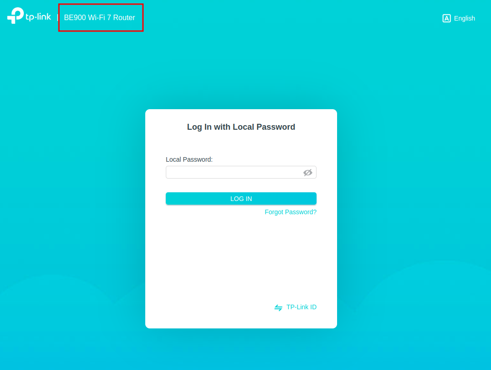

# 1) Introducción.

Vamos a realizar el hardening sobre un router de la marca TP-Link, concretamente el modelo Archer BE900. Se trata de un router cuatribanda y con soporte para Wi-fi 7.

Para realizar dicho hardening, vamos a detallar los pasos a continuacion.
# 2) Primeras consideraciones y visión general del dispositivo.

Al acceder a la interfaz web de configuración del router, se nos pedirá la contraseña de usuario (la contraseña será la que viene por defecto, la cambiaremos mas adelante).

Una vez hayamos introducido la contraseña correctamente, es interesante que, lo primero que nos advierten es de la existencia de una actualización del firmware, evidentemente, lo actualizaremos pues es una de los factores fundamentales de un buen hardening (más adelante configuraremos las actualizaciones automáticas).

Terminada la actualización, podremos navegar por las diferentes categorías. Nosotros vamos a centrarnos en esta guía solo en las que están directamente relacionadas con la seguridad.

> [!NOTE]
> Solo vamos a configurar/modificar aquellas opciones fundamentales para hacer hardening, no vamos a entrar en configuraciones de rendimiento (como activar MU-MIMO, por ejemplo), o personalización.

Pero se puede consultar como en cualquier router, un mapa de la red.

Configuraciones especificas de los puertos ethernet.

Y configuraciones especificas de personalización del propio modelo de router, entre otros.

# 3) Configuraciones de las redes Wi-Fi.

Una vez realizada nuestra primera toma de contacto y nuestro pequeño tour por todas las opciones del dispositivo, comenzamos con nuestro hardening. Lo primero que haremos será configurar de manera correcta los diferentes SSID (redes Wi-Fi, para que nos entendamos) que vamos a poner a disposición de los usuarios para conectarse.

A la hora de configurarlos, es importante que tengamos en cuenta las siguientes opciones:

## 3.1) Ocultar SSID.

Es importante que marquemos siempre la opción de ocultar el nombre del SSID, o en inglés "Hide SSID", ya que de esta forma evitaremos que se muestren los nombres de nuestras redes wifi en un escaneo simple de redes disponibles, y así solo podrán conectarse los usuarios que conozcan el nombre del SSID (si bien es cierto que con algunas herramientas pueden conocerse los SSID ocultos, es una medida a tener en cuenta, pues la mayoría de usuarios usarán un escaneo básico)

## 3.2) Nomenclatura de los SSID.

Aunque vamos a ocultar el nombre de los SSID, es recomendable aun así, que los nombremos con nombres genéricos, de modo que los nombres no den información de a quien o a qué pertenecen (departamento, por ejemplo) el SSID, ademas de no dar información sobre el modelo de router. Como vemos, por defecto, el nombre de los SSID que tiene configurados el router ya están diciendo la marca del mismo, añadiendo la banda en la que están trabajando.

Debemos elegir nombres genéricos, que no den ningún tipo de información sensible, como por ejemplo:

## 3.3) Tipo de cifrado de las claves.

Si bien es recomendable el uso de un cifrado WPA3 con autenticación 802.1X (si está disponible) para las claves, es cierto que algunos dispositivos más antiguos no soportan este tipo de cifrado, por lo que, si sabemos que puede darse el caso de que alguno de los dispositivos que van a conectarse a nuestra red entra dentro de este grupo, deberemos optar por el cifrado WPA2-AES con autenticación 802.1X (si está disponible). En el caso de este router, nos da la opción de usar ambos tipos de cifrado simultáneamente, así que no tendremos problema, seleccionaremos WPA3-Personal+WPA2-PSK[AES] en el caso de que queramos asegurar nuestras redes en un entorno doméstico.

Si quisiéramos hacer el hardening para un entorno empresarial, usaríamos las versiones "Enterprise", que añaden mas seguridad, ya que los usuarios deberían identificarse con credenciales almacenadas en un servidor Radius. 

Lo que debemos evitar tanto en entorno doméstico y empresarial son los métodos de cifrado WEP y WPA, ya que está obsoletos y son muy inseguros (los routers actuales ya no los ofrecen).

## 3.4) Complejidad de la contraseña.

Es muy importante, elegir una contraseña robusta para nuestros SSID, preferiblemente superiores a los 15 caracteres y de todo tipo, números, letras, caracteres especiales, etc. Para conseguir que sean difíciles de conseguir por fuerza bruta.

## 3.5) Aislamiento de SSID.

Una práctica muy recomendable es la de aislar (isolate) los SSID (siempre que el dispositivo nos lo permita). Principalmente, se suele separar como mínimo una red para invitados (guests) y otra para dispositivos IoT. De este modo nos aseguraremos de que los SSID queden aislados unos de otros, y nos permitirá opciones extra como asignar un limite de ancho de banda, entre otros. Lo cual nos aporta un extra de seguridad, ya que los datos de las conexiones serán independientes.

En nuestro caso, este dispositivo por defecto nos trae la opción para crear los SSID aislados, en el caso de que no vinieran por defecto, tan solo tendríamos que crear varios SSID aislados.

# 4) Controles parentales.

Otra opción muy interesante es la de activar el control parental, en el caso de que haya niños que vayan a usar la conexión, de esta forma podremos bloquear el acceso a páginas o contenido que sabemos de antemano que pueden ser maliciosos, dándonos un extra de seguridad, aunque si bien es cierto que también podríamos bloquearlas con un firewall.

# 5) Configuraciones avanzadas.

## 5.1) Creación de VLAN.

Dentro de lo posible (en nuestro caso, el dispositivo no nos permite crear todas las VLAN que queramos, tan solo una para IPTV, otra para internet y una ultima para VoIP), sería recomendable crear VLAN separadas para cada servicio, de este modo las conexiones serán mucho más seguras.

## 5.2) Asignación de IP estáticas.

Podemos asignar IP estáticas para cada dispositivo, de esta forma siempre sabremos de que dispositivo se trata a la hora de gestionar un incidente.

## 5.3) Acceso remoto al dispositivo.

En nuestro caso, viene desactivado por defecto, pero es importante desactivar el acceso remoto para configurar el dispositivo, en caso de que viniera activado. De esto modo conseguiremos que para poder configurarlo, se tenga que estar conectado a la misma red.

## 5.4) Configuración avanzada de SSID's aislados.

Este dispositivo, en sus ajustes avanzados, nos permite hacer algunas configuraciones avanzadas sobre los SSID aislados que vimos anteriormente, más concretamente sobre el SSID de invitados (guests), a los que debemos desmarcar los permisos para que se vean los dispositivos unos a otros en la red y para que no puedan acceder a la red local.

## 5.5) Apagado programado.

Otra opción de seguridad muy interesante es poder programar un "calendario", en el que podremos configurar el tiempo en el que queremos que se desactiven nuestras redes wifi, con esto conseguiremos que no estén disponibles durante los periodos de tiempo que nos nos interesan, por ejemplo, fuera del horario laboral, de este modo nadie podrá usar la conexión fuera de horarios en los que no podamos monitorizar el uso.

## 5.6) Desactivación de WPS.

Es muy importante que desactivemos la opción de conexión WPS, ya que es muy inseguro debido a lo débiles que son las contraseñas que usa.

## 5.7) Aislamiento de AP.

Debemos activar el aislamiento (isolate) de los puntos de acceso, de este modo, todos serán independientes.

## 5.8) Opciones USB.

Desactivaremos todas las opciones para compartir la información de un USB conectado al dispositivo, con esto evitaremos que algún usuario pueda compartir datos maliciosos en la red.

## 5.9) Desactivar UPnP.

Desactivaremos el servicio UPnP, de esta manera evitaremos que las aplicaciones puedan abrir puertos por ellas mismas, y así, seremos nosotros los que abriremos los puertos que sean necesarios, cuando sea oportuno.

## 5.10) Uso de DMZ.

A no ser que sea necesario su uso, desactivaremos la zona desmilitarizada (DMZ), ya que evitaremos que uno de nuestros equipos esté expuesto a internet directamente.

## 5.11) Configuración Firewall.

En nuestro caso, en este dispositivo las configuraciones del Firewall son bastante limitadas, por no decir nulas, así que desactivaremos los pings desde la red WAN y desde la red local, y dejaremos activo el Firewall con sus configuraciones por defecto. En otros dispositivos podremos configurar reglas de tráfico.

## 5.12) Control de acceso.

Configuraremos el control de acceso, de modo que solo dejaremos establecer conexión a los dispositivos mediante la MAC del mismo, así, solo los dispositivos cuya MAC se encuentre en el listado seguro, podrán establecer conexión.

## 5.13) Unir IP y MAC.

Relacionaremos cada IP estática a la MAC del dispositivo correspondiente, de este modo evitaremos los ataques de ARP spoofing, ya que no podrán hacerse pasar por ningún dispositivo conocido.

## 5.14) Puertas de enlace de aplicaciones (ALG).

Desactivaremos PPTP passthrough ya que es un protocolo VPN obsoleto y muy inseguro. L2TP lo activaremos solo si necesitamos crear un tunel VPN de tipo L2TP/IP, el resto de opciones, no tienen un impacto demasiado significativo en lo que a la seguridad de nuestra red actual se refiere.

## 5.15) Aislamiento de dispositivos.

Podremos aislar los dispositivos los unos de los otros con esta opción, nos recomienda el fabricante que en caso de elegir esta opción, se desactive el aislamiento de AP que vimos anteriormente.

## 5.16) Configuración VPN.

Siempre que podamos, lo ideal es crear un túnel VPN para las conexiones, de este modo nos ahorraremos tener que estar gestionando puertos y demás, ya que solo se podrán conectar los usuarios que tengan acceso a dicha VPN.

Podremos configurar también, los servidores VPN que tengamos disponibles, por supuesto, debemos configurarlos con claves robustas.

## 5.17) Configuración IPv6.

Si en nuestra red no se va a hacer uso del protocolo IPv6, lo aconsejable es desactivarlo, así evitaremos tener que securizarlo sin necesidad y que se convierta en un vector de ataque.

## 5.18) Integración del dispositivo con asistentes IoT.

No es recomendable integrar el dispositivo son asistentes como Alexa, etc. Ya que podrán configurar el dispositivo por ellos mismos y acceder a su sistema. Por lo que no lo configuraremos.

## 5.19) Uso de dispositivos Mesh.

En el caso de que no tengamos antenas Mesh, desactivaremos la opción, ya que si no es necesario es un riesgo absurdo a correr.

## 5.20) Actualizaciones de Firmware.

Esta es una opción muy importante a tener en cuenta, es fundamental para la seguridad del dispositivo y de nuestras redes, que tengamos activadas siempre las actualizaciones automáticas, de esta forma el dispositivo contará siempre con los últimos parches y actualizaciones, reduciendo así al máximo el riesgo de contar con vulnerabilidades.

## 5.21) Copias de seguridad de configuración.

Es recomendable, crear una copia de seguridad de la configuración del dispositivo, de este modo, podremos restaurarla o recuperarla en caso de fallo del sistema.

## 5.22) Cambio de credenciales.

Es fundamental, que cambiemos las contraseñas de acceso a la configuración del dispositivo, creando una contraseña robusta y difícil de averiguar, usando caracteres alfanuméricos, caracteres especiales, etc.

# 6) Conclusiones.

Teniendo en cuenta todas estas indicaciones, podremos tener nuestras red wifi lo mas asegurada posible, evidentemente, debemos adaptar todos estos consejos a nuestras necesidades y usos particulares. SI bien es cierto que en la guía estan al final las opciones de actualización de Firmware automáticamente y la de cambio de credenciales de acceso, no quiere decir que sean las menos importantes, al contrario, quizás sean las mas básica, importantes y fundamentales, han aparecido al final por el orden en el que están en el flujo del menú del dispositivo.