**Parte 3 – Análisis de nuestro certificado y de certificados erróneos (vía realista)**

[1. Introducción](#__refheading___toc106_2306903008)

[2. Análisis de nuestro certificado](#__refheading___toc108_2306903008)

[3. Análisis de certificados erróneos](#__refheading___toc307_2306903008)

[3.1 Certificado expirado](#__refheading___toc309_2306903008)

[3.2 Certificado revocado](#__refheading___toc311_2306903008)

[3.3 Certificado auto-firmado](#__refheading___toc313_2306903008)

[3.4 Certificado con nombre de dominio desconocido](#__refheading___toc315_2306903008)

[3.5 Certificado con entidad certificadora no confiable](#__refheading___toc321_2306903008)

[4. Conclusión](#__refheading___toc323_2306903008)

# **1. Introducción**
   Para realizar esta tercera parte del proyecto, se nos propone lo siguiente:

   Analiza el certificado válido de tu sitio web de la parte 2 en un servicio como SSL Labs y explica, en base a los resultados, los motivos que llevan a verificarlo como válido.

   Luego, localiza tres certificados erróneos de diferente tipo en sitios web. Analízalos también usando un servicio y explica los motivos que llevan a verificarlos como no válidos.

   Los certificados erróneos que hemos utilizado se han obtenido de la web [www.badssl.com](http://www.badssl.com/), la cual nos proporciona varias webs con certificados erróneos creados expresamente para poder realizar pruebas y comprobaciones.

# **2. Análisis de nuestro certificado**
   Comenzamos analizando nuestro certificado, haciendo uso del servicio sugerido ([SSL Labs](https://www.ssllabs.com/ssltest/)), para poder indicar los motivos principales por los que se considera un certificado válido.

   En el sumario general, vemos como la calificación del certificado es bastante alta, indicándonos que no presenta ningún problema y remarcando que soporta el protocolo de seguridad en la capa de transporte TLS 1.3, el cual es el más avanzado actualmente.

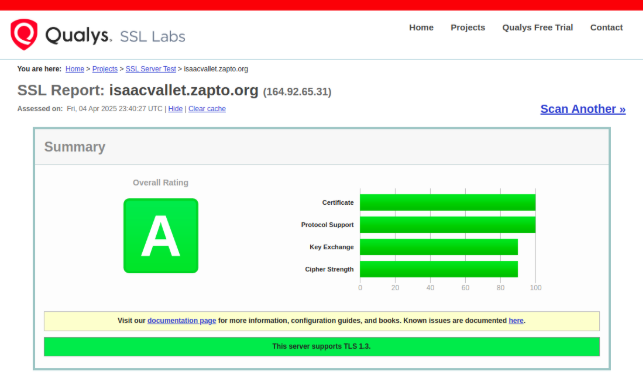

   En los detalles del propio certificado vemos otros aspectos muy importantes que hacen que nuestro certificado sea considerado como válido, como son:

- **Fechas de validez correctas:** ya que la fecha actual es posterior a la fecha de expedición del certificado y posterior a la fecha de caducidad.
- **La entidad certificadora es confiable:** vemos que la entidad certificadora está aprobada y verificada para todos los navegadores.
- **No está revocado:** podemos comprobar como en el apartado de revocación del certificado todo está correcto y no está revocado por la entidad certificadora.

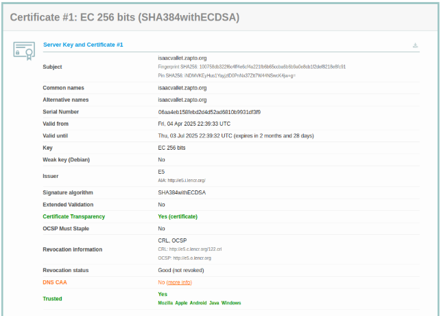

En la siguiente pestaña de detalles, podemos ver como todas **las rutas del certificado en la cadena completa son correctas**, lo cual, evidentemente, hacen que el certificado en ese aspecto cumpla las condiciones para ser válido.

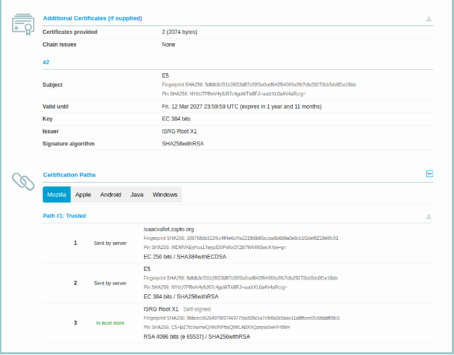

En la sección de protocolos y cifrados, vemos como nuestro certificado cumple con los estándares mas actuales.

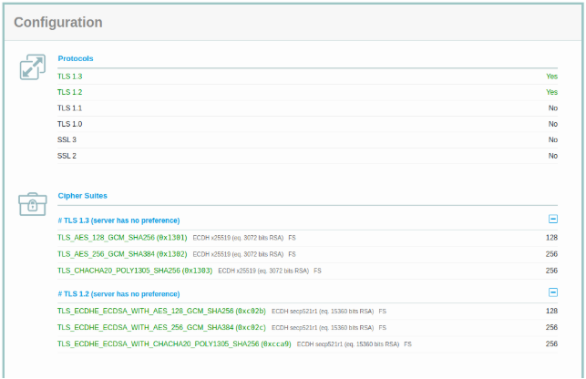

En los resultados de las pruebas de handshake con los diferentes navegadores y sistemas, vemos que es compatible con casi todos.

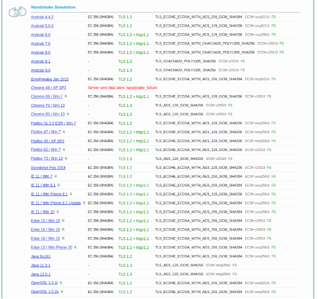

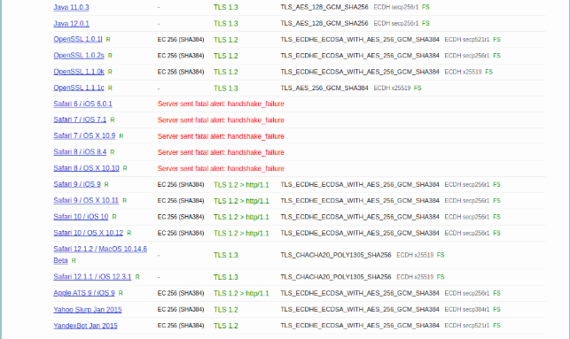

Y por ultimo, podemos ver como cumple con los protocolos de seguridad más usados.

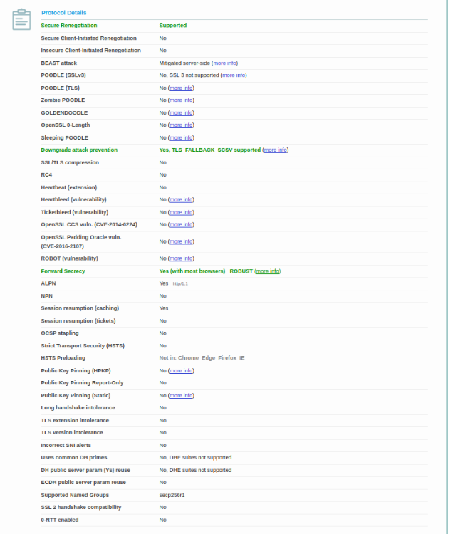

# **3. Análisis de certificados erróneos**
   Vamos a realizar un análisis de diversos certificados erróneos y ver que motivo es el que ha dado lugar a que sean considerados como tal. Para realizar este análisis se ha usado también el servicio sugerido ([SSL Labs](https://www.ssllabs.com/ssltest/)).

## **3.1 Certificado expirado**
      Al acceder a la web, encontramos el error NET::ERR\_CERT\_DATE\_INVALID.

      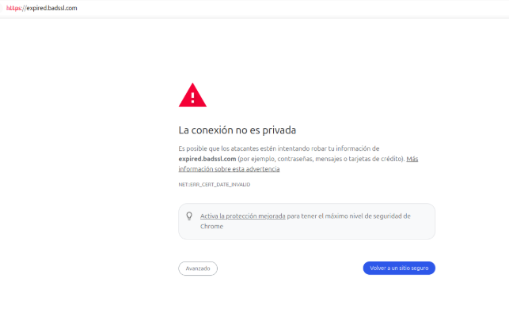

      Esto, es debido a que el certificado de la página está obsoleto, es decir, la fecha de caducidad del certificado ya ha pasado. En este caso, la fecha de caducidad del certificado era el 12 de Abril de 2015, por lo que expiró hace ya 9 años y 11 meses como podemos ver en la siguiente captura.

      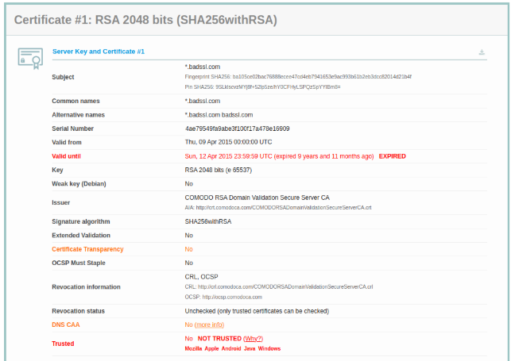

      En el caso de este certificado, vemos que no sólo habría expirado el certificado principal, sino que están obsoletos todos los certificados de la cadena, como vemos en las siguientes capturas.

      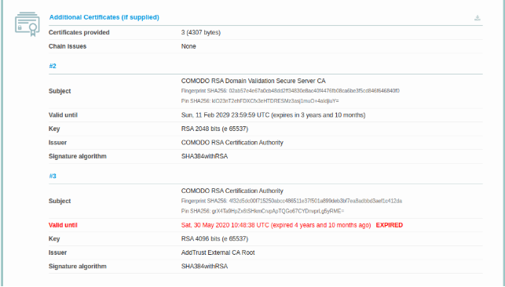

      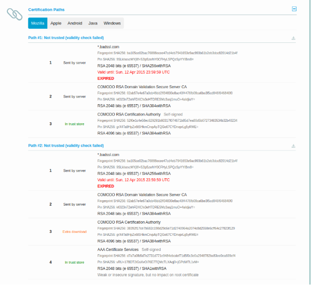

      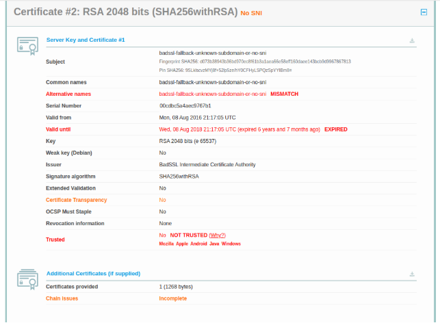

      Aunque este certificado cuenta con otros motivos para no ser válido, como que la los nombres alternativos no concuerdan, entre otros, el principal motivo para considerar este certificado como no valido es que está obsoleto. 

## **3.2 Certificado revocado**
      En este caso, al acceder a la web recibimos NET::ERR\_CERT\_REVOKED

      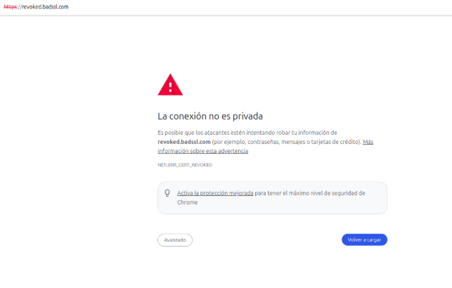

      Este error, como bien indica, quiere decir que el certificado está revocado por la entidad certificadora, es decir, que la entidad certificadora lo ha invalidado. Esto puede suceder por diversos motivos como compromisos de seguridad o mal uso del certificado, entre otros. En todo caso, siempre será porque la entidad certificadora ha determinado que el certificado ya no es confiable.

      Podemos ver en la siguiente captura, el resultado que nos ha arrojado el servicio utilizado, donde aparece la el estado de revocación del certificado.

      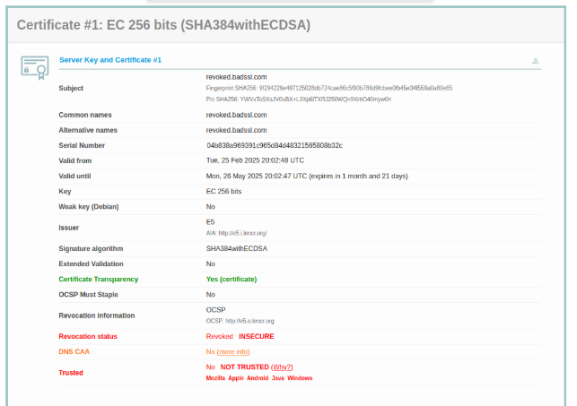

## **3.3 Certificado auto-firmado**
      En este caso, tenemos un certificado auto-firmado, es decir, que no ha sido expedido por ninguna entidad certificadora de confianza, por lo que el certificado no puede considerarse como seguro.

      En las siguientes capturas, podemos ver como en el análisis realizado por el servicio utilizado, nos indica que la entidad certificadora no está verificada, incluso, en la ultima captura, podremos ver como nos indica que la cadena de certificación está incompleta, esto se debe a eso mismo, que no existe una entidad certificadora en el comienzo de la misma.

      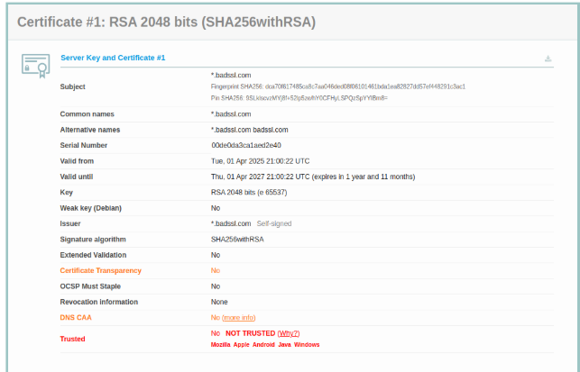

      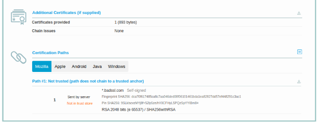

      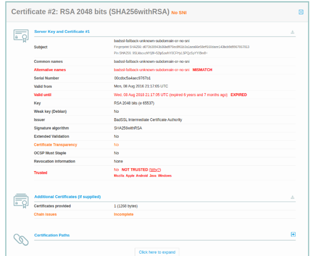

## **3.4 Certificado con nombre de dominio desconocido**
      Al acceder a la web, en este caso, recibimos NET::ERR\_CERT\_COMMON\_NAME\_INVALID, esto se debe a que el nombre del dominio al que estamos intentado acceder no se encuentra en el listado SSL del propio sitio web, es decir, que o bien, hay un error en la configuración del sitio web, o, el certificado no corresponde al dominio.

      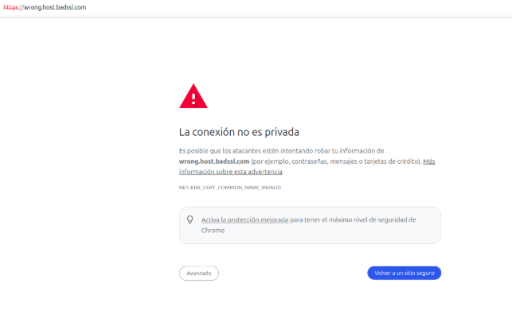

      Podemos ver en la captura siguiente, como en el informe del servicio utilizado nos avisa de que el nombre de dominio no concuerda con el nombre de dominio del certificado.

      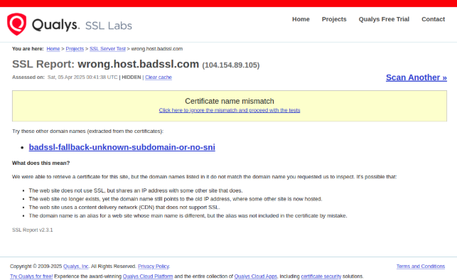

## **3.5 Certificado con entidad certificadora no confiable**
      En este caso, al acceder a la web, obtenemos NET::ERR\_CERT\_AUTHORITY\_INVALID.

      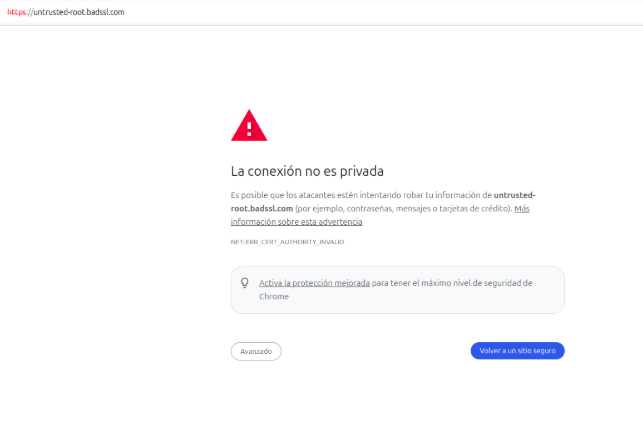

      Esto es debido a que la entidad certificadora que expidió el certificado no es confiable, esto se puede deber a motivos como que el certificado sea auto-firmado, o que la entidad certificadora no se encuentre en el listado de entidades certificadoras reconocidas del navegador.

      En las siguientes capturas, que muestran el resultado del análisis del servicio utilizado, podemos ver como nos advierte de que la entidad certificadora no es confiable y que no se encuentra en el listado de entidades confiables.

      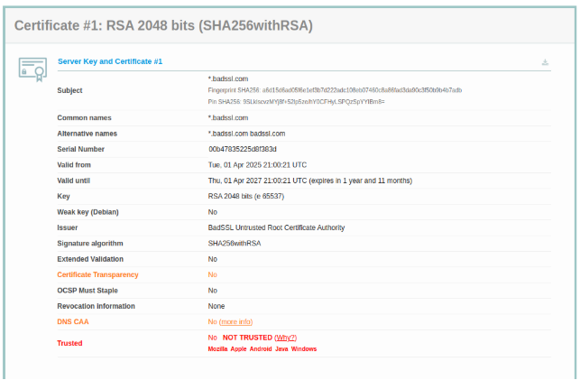

      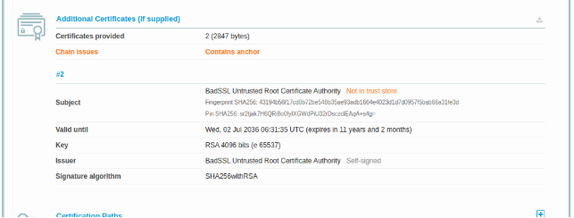

# **4. Conclusión**
   Tras haber analizado nuestro propio certificado, como los certificados erróneos expuestos en este documento con el servicio  [SSL Labs](https://www.ssllabs.com/ssltest/), podemos afirmar que los motivos principales que pueden hacer que un certificado sea válido o no, son los siguientes:

- Se utiliza antes de su fecha de activación.
- Se utiliza después de su fecha de caducidad.
- Los nombres de dominio del certificado no coinciden con el nombre de dominio del sitio.
- Ha sido revocado por la entidad certificadora.
- Tiene firma insegura.
- Ha sido incluido en la lista negra.
- La cadena de certificados no contiene todos los certificados necesarios para conectar el certificado del servidor web a uno de los certificados raíz de nuestro almacén de confianza. Con menos frecuencia, uno de los certificados de la cadena (excepto el del servidor web) ha caducado, lo que invalida toda la cadena.
- Autoridad de certificación desconocida
- Problemas de interoperatividad, en algunos casos excepcionales, no se puede establecer la confianza debido a problemas de interoperatividad entre nuestro código y el código o la configuración que se ejecuta en el servidor.
