**Parte 2 – Comparativa con otro certificado válido (vía realista)**

**Índice**

[1. Introducción](#__refheading___toc107_1526397747)

[2. Comparativa básica](#__refheading___toc109_1526397747)

[3. Comparativa detallada](#__refheading___toc111_1526397747)

[3.1 Validez del certificado](#__refheading___toc113_1526397747)

[3.2 Algoritmo de cifrado](#__refheading___toc115_1526397747)

[3.3 Certificado Raíz (Entidad certificadora)](#__refheading___toc117_1526397747)

[3.4 Uso de SANs](#__refheading___toc119_1526397747)

[4. Conclusión](#__refheading___toc121_1526397747)

# **1. Introducción**
   En esta segunda parte del proyecto, para realizarlo por la vía realista, se nos propone lo siguiente:

   En el servidor VPS de la parte 1, instala un servidor web y prepáralo para servir una página de prueba. Necesitarás un dominio. Con la mochila del estudiante de Github puedes hacerlo de forma gratuita. También puedes probar en el servicio Freenom o en FreeHostingEU. Luego configura HTTPS con un certificado válido. Puedes hacerlo de forma gratuita gracias a servicios como Let´s Encrypt. Obtén una captura de los datos de tu certificado que proporciona el navegador.

   Ahora, acude a un sitio web verificado y obtén una captura de los datos de su certificado.

   Analiza y compara las diferencias entre ambos en un documento.

   Debido a que no hay, o yo no he podido al menos encontrarlo tras una ardua búsqueda, forma alguna de conseguir un dominio gratuito, he usado el servicio de [www.noip.com](http://www.noip.com/), el cual nos proporciona un DNS dinámico, creando un subdominio, el cual nos servirá como si de un dominio en sí se tratase. En concreto el subdominio creado ha sido isaacvallet.zapto.org, una vez creado se han realizado las configuraciones necesarias para que este subdominio apunte a la IP de nuestro servidor VPS en el que tenemos nuestro servidor web Apache.
   # **2. Comparativa básica**
   El navegador utilizado es Google Chrome, y nos arroja los siguientes datos de nuestro certificado, que podemos ver en las capturas siguientes:

   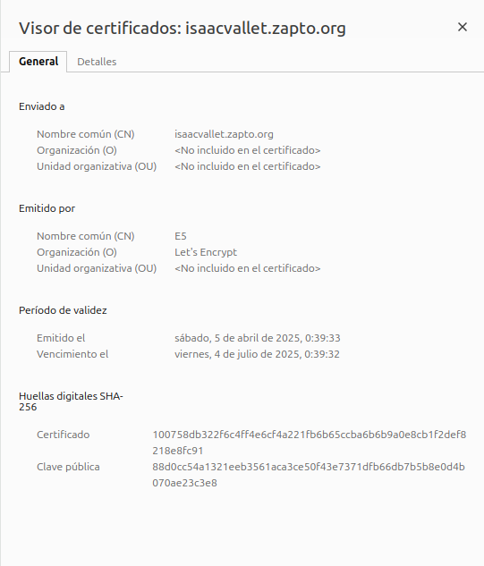

   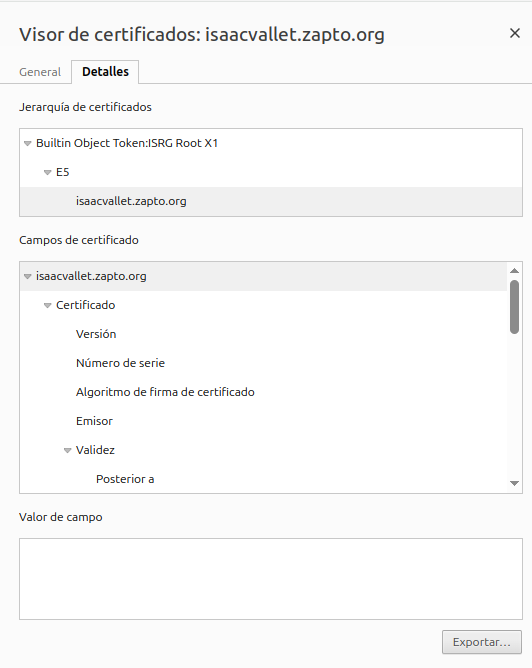

   Así mismo, vemos la información del certificado de un sitio verificado, es verdad que no he tenido mucha originalidad a la hora de elegir el sitio, pero… que puede estar mas verificado que google?. Nos arroja los siguientes resultados:

   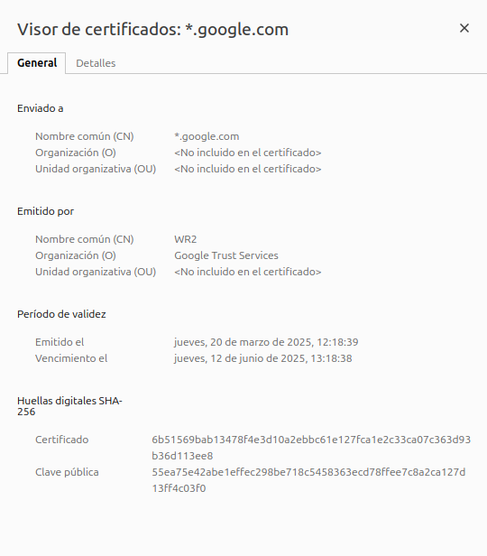

   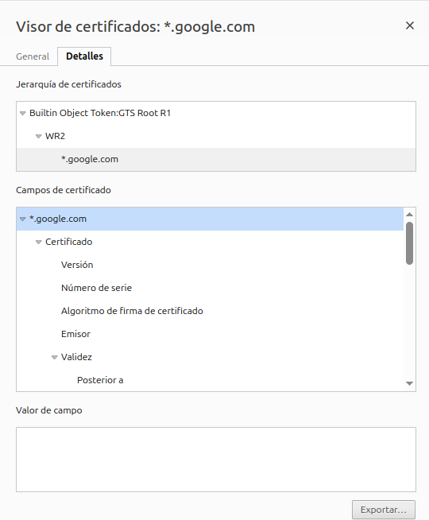

   Si observamos la información básica de los certificados, no veremos muchas diferencias, ya que ambos son certificados válidos. Realizaremos a continuación una comparativa algo más detallada.
   # **3. Comparativa detallada**
   
   ## **3.1 Validez del certificado**
      Si bien es cierto que tanto en el sitio web de Google como en nuestro sitio el certificado tiene una duración de unos 90 días, cabe reseñar que Let’s Encrypt solo genera certificados con esta duración como máximo, Google y otros sitios comerciales generan certificados con una validez de 1 a 2 años, siendo estos de corta duración (90 días), pero renovados automáticamente hasta cumplir la validez real máxima. En el caso de nuestro certificado, deberemos actualizarlo manualmente, o bien, usar certbot para que se encargue de actualizarlo automáticamente.

      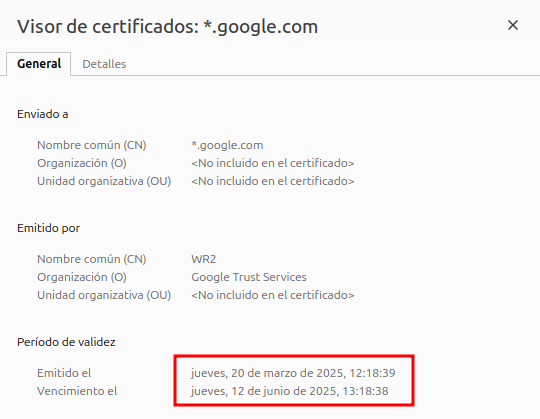

      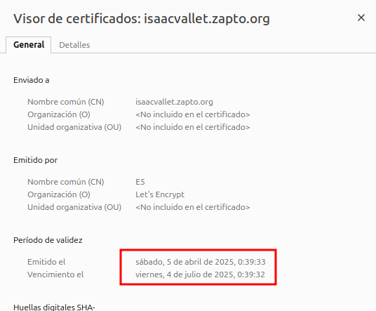

   ## **3.2 Algoritmo de cifrado**
      Si nos fijamos en el algoritmo de cifrado utilizado en ambos certificados, veremos que se trata de un cifrado SHA-256 con cifrado RSA. El cual es bastante seguro y actual.

      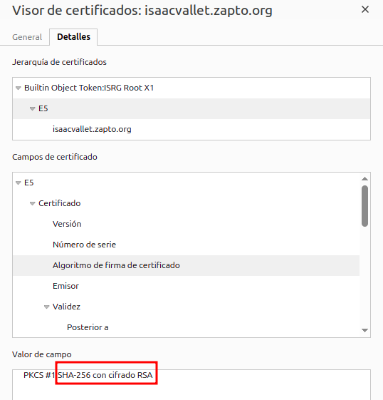

      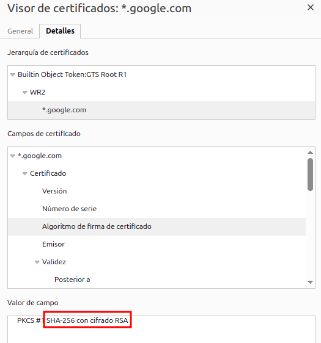
   ## **3.3 Certificado Raíz (Entidad certificadora)**
      En este caso, cada certificado cuenta con un certificado raíz diferente, en el caso de Google, usa un certificado raíz propio GTS Root R1 (Google Trust Services) que esta incluida en todos los navegadores. De este modo, al ser una entidad certificadora propia, tienen un mayor control sobre sus certificados.

      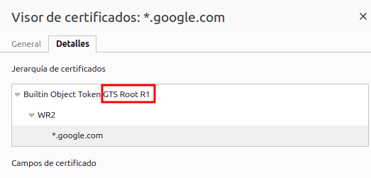

      En el caso de nuestro certificado, cuenta con el certificado raíz ISRG Root X1, el cual es reconocido a nivel global, pero dependen de un tercero para la expedición de certificados confiables.

      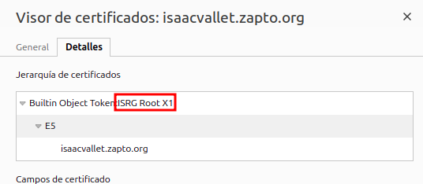
   ## **3.4 Uso de SANs**
      Si nos fijamos en el certificado de Google, vemos que hace uso de SANs, que son nombres alternativos para el certificado, esto sirve para asociar varios nombres de dominios, subdominios, ips y otros identificadores a un miso certificado, de este modo se ahorran costes y se simplifica la gestión de los certificados. Nuestro certificado, no los tiene.

      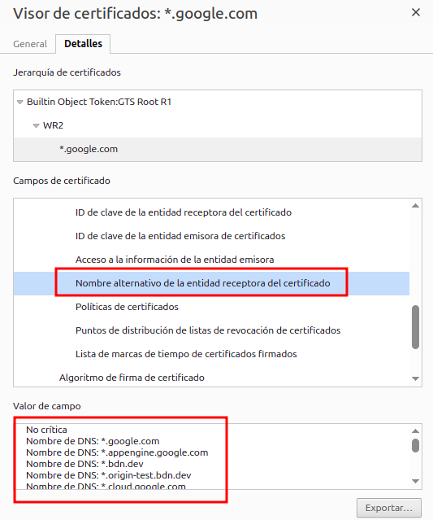
   # **4. Conclusión**
   Comparando ambos certificados, hemos llegado a la conclusión de que tienen mas similitudes que diferencias, ambos son certificados válidos y seguros y usan tecnologías y sistemas modernos y actuales.
